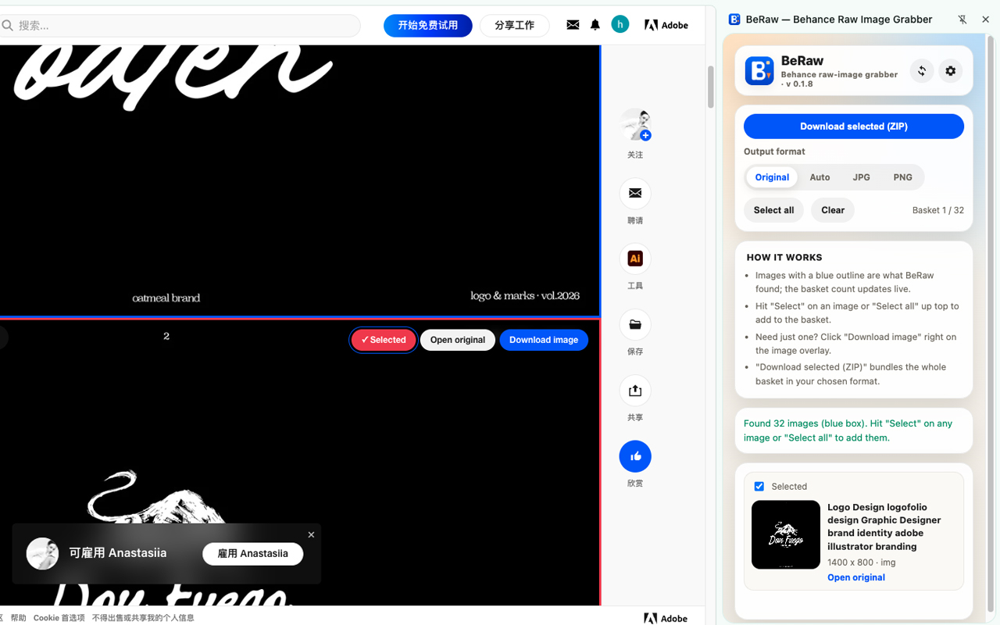

<p align="center">
  
</p>

<h1 align="center">BeRaw</h1>

<p align="center">
  <strong>Pull full-size raw images out of any Behance project.</strong><br>
  The Chrome side panel for designers, researchers, and mood-board builders — one click per image, or batch the whole project into a ZIP.
</p>

<p align="center">
  <a href="https://github.com/hooosberg/BeRaw/releases/latest">
    
  </a>
  <a href="https://hooosberg.github.io/BeRaw/">
    
  </a>
  <a href="https://github.com/hooosberg/BeRaw">
    
  </a>
</p>

<p align="center">
  <em>If BeRaw helps your research workflow, please ⭐ star this repo — it helps other designers find it.</em>
</p>

<p align="center">
  <a href="https://github.com/hooosberg/BeRaw/releases/latest">
    
  </a>
  <a href="./LICENSE">
    
  </a>
  
  
  
  
</p>

<p align="center">
  <strong>
    English &nbsp;|&nbsp;
    <a href="./README.zh-CN.md">简体中文</a> &nbsp;|&nbsp;
    <a href="./README.zh-TW.md">繁體中文</a> &nbsp;|&nbsp;
    <a href="./README.ja.md">日本語</a> &nbsp;|&nbsp;
    <a href="./README.ko.md">한국어</a> &nbsp;|&nbsp;
    <a href="./README.fr.md">Français</a> &nbsp;|&nbsp;
    <a href="./README.de.md">Deutsch</a> &nbsp;|&nbsp;
    <a href="./README.es.md">Español</a> &nbsp;|&nbsp;
    <a href="./README.pt.md">Português</a> &nbsp;|&nbsp;
    <a href="./README.ru.md">Русский</a> &nbsp;|&nbsp;
    <a href="./README.it.md">Italiano</a> &nbsp;|&nbsp;
    <a href="./README.vi.md">Tiếng Việt</a>
  </strong>
</p>

<p align="center">
  
</p>

---

## About

**BeRaw** is a Chrome side panel scoped to `behance.net`. Open any Behance project — BeRaw scans the page, highlights every large image with a blue outline, and drops them into a picker. Pick the ones you want (or hit **Select all**), and pull them down as individual files or one ZIP.

No cloud. No account. No bulk-downloader nonsense — BeRaw exists because the official Behance experience doesn't expose originals, and reference boards need originals.

## Highlights

### 1. Raw, Not Preview

BeRaw pulls the largest file available on Behance's CDN, not the downsized preview. What you save is the file the designer actually uploaded — full resolution, native format.

### 2. Single-Click or Batch-ZIP

- **Per-image** — the overlay button on each outlined image downloads just that one in the format you chose.
- **Batch to ZIP** — the side panel packs every selected image into a single archive; no browser "save as" popup per file.

### 3. Format Control

Pick the output behavior that fits your workflow:

| Format | What it does |
| ------ | ------------ |
| **Original** | No re-encoding. Pulls the largest CDN file. WebP transcoded to JPG/PNG at max quality. |
| **Auto** | WebP becomes JPG, everything else passes through untouched. |
| **JPG** | Everything flattens to JPG. Transparent areas go white. Good for delivery. |
| **PNG** | Everything becomes PNG. Keeps transparency. |

### 4. 100% Local & Private

BeRaw runs entirely in your browser. No analytics, no account, no third-party server. The extension is scoped by manifest to `behance.net` only, and BeRaw talks to exactly one endpoint outside Behance: the public GitHub Releases API, only when you click **Check for updates**.

### 5. Twelve UI Languages

UI strings ship in English, Simplified Chinese, Traditional Chinese, Japanese, Korean, French, German, Spanish, Portuguese, Russian, Italian, and Vietnamese. Auto-picks your Chrome language; the side panel lets you switch manually.

### 6. Built-in Updater

Settings → About → **Check for updates** pings the GitHub Releases API and surfaces the latest version with a one-click download link. No Chrome Web Store dependency.

## How It Works

```
Behance project page   (open as normal)
    ↓  content script scans the DOM for /srcset/source elements
Detected large images  (blue outline overlay + per-image download button)
    ↓  you pick (Select all, or click individual tiles)
Side panel queue       (live thumbnails, format selector, size totals)
    ↓  click "Download selected (ZIP)" or per-image "Download image"
CDN fetch              (largest available URL, streamed)
    ↓  optional WebP → JPG/PNG transcode in browser
File(s) or ZIP         (your Downloads folder)
```

No remote server in the loop. BeRaw never sees what you downloaded — neither does anyone else.

## Quick Start

1. **Install** — Download the latest `.zip` from [Releases](https://github.com/hooosberg/BeRaw/releases/latest), unzip to a stable folder (don't delete it after install), open `chrome://extensions`, enable **Developer mode**, click **Load unpacked**, pick the unzipped folder. *(Chrome Web Store listing in review.)*
2. **Open any Behance project** — The blue outlines appear on large images.
3. **Pick + format** — Click **Select** on an image or **Select all** in the side panel. Choose **Original** / **Auto** / **JPG** / **PNG**.
4. **Download** — Click **Download selected (ZIP)** for batch, or the per-image button for one file.

## Why Not Just Right-Click?

| | Right-click → Save As | Third-party screen grabber | Generic Chrome "download all" | **BeRaw** |
|---|---|---|---|---|
| **Resolution** | Whatever the page shows (often downsized) | Screenshot → re-encoded | Every ``, including 1px trackers | Largest CDN file per project image |
| **WebP handling** | You transcode manually | Lossy re-encode | You transcode manually | Browser transcode to JPG/PNG at max quality |
| **Per-project batching** | One file at a time | Region capture, not per-file | Noisy — filters everything on the page | Project-scoped picker + single ZIP |
| **Setup friction** | None | Install per tool | Generic, no per-site logic | One install, works on every Behance project |
| **Privacy** | Local | Varies | Local | 100% local, no telemetry |

## Repository Layout

```
local/                  Chrome extension source (load-unpacked target)
  manifest.json
  sidepanel.html · popup.{js,css}
  content.js · background.js · archive.js
  locales.js            all 12 locales in one flat map
  icons/                16 / 32 / 48 / 128 PNG icons

github/
  README.md             this file
  README.*.md           11 translations
  LICENSE               BUSL-1.1
  pack-release.sh       build script (reads local/manifest.json)
  releases/             local zip staging (gitignored)
  site/                 GitHub Pages landing page
  .github/workflows/    auto-deploy site/ to Pages
```

## Publishing a New Version

1. Bump `version` in [`local/manifest.json`](local/manifest.json) and push `main`.
2. From the repo root, run `bash pack-release.sh` — writes `releases/BeRaw-{version}.zip` (flat structure, ready for Load unpacked).
3. [Create a new release](https://github.com/hooosberg/BeRaw/releases/new) tagged `v{version}`, attach the zip, publish.
4. Every installed extension will see the new version on its next **Check for updates** ping.

## Contributing

Bug reports, translation fixes, and new locales welcome. For translations, edit `local/locales.js` — each locale is a flat `{key: string}` map and keys mirror `LOCALES["en"]`.

## Resources

- **Website**: [hooosberg.github.io/BeRaw](https://hooosberg.github.io/BeRaw/)
- **Download**: [Latest release](https://github.com/hooosberg/BeRaw/releases/latest)
- **License (web-formatted)**: [hooosberg.github.io/BeRaw/license.html](https://hooosberg.github.io/BeRaw/license.html)
- **Terms of Service**: [hooosberg.github.io/BeRaw/terms.html](https://hooosberg.github.io/BeRaw/terms.html)
- **Privacy Policy**: [hooosberg.github.io/BeRaw/privacy.html](https://hooosberg.github.io/BeRaw/privacy.html)

## Contact

- **GitHub**: [hooosberg/BeRaw](https://github.com/hooosberg/BeRaw) · [Issues](https://github.com/hooosberg/BeRaw/issues)
- **Commercial licensing, custom terms, partnerships**: [zikedece@proton.me](mailto:zikedece@proton.me)

## Respect for creators

BeRaw only downloads publicly accessible Behance images. Works on Behance are the property of their creators — please use BeRaw for personal reference, mood boards, and design research, and follow [Behance's Terms of Use](https://www.behance.net/misc/terms). If you use a creator's work, credit them.

## Sibling projects

Built by [hooosberg](https://github.com/hooosberg):

- [AgentLimb](https://agentlimb.com) — teach AI to control your browser
- [Packpour](https://hooosberg.github.io/Packpour/) — App Store Connect locale filler
- [WitNote](https://hooosberg.github.io/WitNote/) — local-first AI writing companion
- [GlotShot](https://hooosberg.github.io/GlotShot/) — perfect App Store preview images
- [TrekReel](https://hooosberg.github.io/TrekReel/) — outdoor trails, cinematic reels
- [DOMPrompter](https://hooosberg.github.io/DOMPrompter/) — visualize DOM for AI code
- [UIXskills](https://uixskills.com) — AI → JSON → Whiteboard → UI

## Friends

- [不二手造](https://artbuer.com) — independent original design studio

## License

BeRaw is distributed under the [Business Source License 1.1](LICENSE) — **free for personal use, paid for commercial use**.

- **Personal use is free.** Individual designers, students, hobbyists, and researchers may use BeRaw at no cost — today and forever.
- **Commercial use requires a separate license.** Any use by or on behalf of a company, organization, or government body needs a paid license. Email <zikedece@proton.me> for terms.
- **Automatic conversion to Apache 2.0 on 2030-04-22.** Four years after initial release the Change Date triggers and BeRaw becomes fully open source for all prior versions.

See [LICENSE](LICENSE) for the full canonical BSL 1.1 text.

Copyright © 2026 hooosberg. All rights reserved.

Not affiliated with Adobe or Behance. All trademarks belong to their owners.
